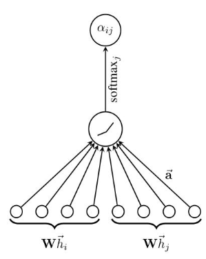
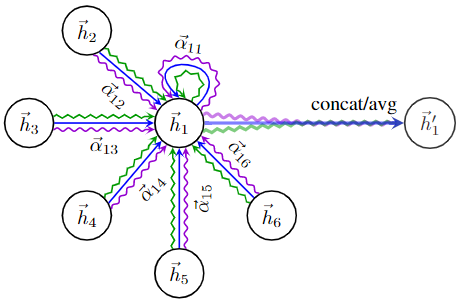

# Graph Attention Network(GAT) 模型解读与tensorflow2.0代码实现

本文的CSDN地址：https://blog.csdn.net/VariableX/article/details/110825537

前面的文章，我们讲解了图神经网络三剑客GCN、GraphSAGE、GAT中的两个：

1. [图卷积神经网络(GCN)理解与tensorflow2.0代码实现](https://blog.csdn.net/VariableX/article/details/109820684)
2. [GraphSAGE 模型解读与tensorflow2.0代码实现](https://blog.csdn.net/VariableX/article/details/110005243)

本要讲的是GAT(Graph Attention Network)，它使用 Attention 机制来对邻居节点进行加权求和，和一般的Attention 机制一样，分为计算注意力系数和加权求和两个步骤。

## Attention 机制

先来看看每一层的输入与输出：
$$
\text { input }: \mathbf{h}=\left\{\vec{h}_{1}, \vec{h}_{2}, \ldots, \vec{h}_{N}\right\}, \vec{h}_{i} \in \mathrm{R}^{F} \\ \text { output }: \mathbf{h}^{\prime}=\left\{\vec{h}_{1}^{\prime}, \vec{h}_{2}^{\prime}, \ldots, \vec{h}_{N}^{\prime}\right\}, \vec{h}_{i}^{\prime} \in \mathrm{R}^{F}
$$

### 1. 计算注意力系数

首先计算顶点 $i$ 与周围邻居节点 $j \in \mathcal N_i$ 的相似度：
$$
e_{i j}=a\left(\mathbf{W} \vec{h}_{i}, \mathbf{W} \vec{h}_{j}\right)
$$
公式中的 $\left(\mathbf{W} \vec{h}_{i}, \mathbf{W} \vec{h}_{j}\right)$ 可以看出特征 $h_i, h_j$ 共享了参数矩阵 $W$，都使用 $W$ 对特征进行线性变换， $(·, ·)$在公式中表示横向拼接。而公式最外层的 $a$ 表示单层前馈神经网络(使用$LeakyReLU$作为激活函数)，输出为一个数值。

有了相关系数，接下来就要进行归一化了，作者使用了 $Softmax$，于是注意力系数的计算过程全貌为：
$$
\begin{aligned}
\alpha_{i j}&=\operatorname{softmax}_{j}\left(e_{i j}\right)\\
&=\frac{\exp \left(e_{i j}\right)}{\sum_{k \in N_{i}} \exp \left(e_{i k}\right)}\\
&=\frac{\exp \left(\operatorname{LeakyReLU}\left(\overrightarrow{\mathbf{a}}^{T}\left[\mathbf{W} \vec{h}_{i} \| \mathbf{W} \vec{h}_{j}\right]\right)\right)}{\sum_{k \in N_{i}} \exp \left(\operatorname{LeakyReLU}\left(\overrightarrow{\mathbf{a}}^{T}\left[\mathbf{W} \vec{h}_{i} \| \mathbf{W} \vec{h}_{k}\right]\right)\right)}
\end{aligned}
$$
其中，$\|$ 表示向量拼接，以上的计算过程如下图所示：



### 2. 加权求和

得到注意力系数之后，就是对邻居节点的特征进行加权求和：
$$
\vec{h}_{i}^{\prime}=\sigma\left(\sum_{j \in N_{i}} \alpha_{i j} \mathbf{W} \vec{h}_{j}\right) 
$$
不过为了更好的学习效果，作者使用了 "multi-head attention"，也就是使用 K 个注意力。对于 K 个注意力又可以使用两种方法对邻居节点进行聚合。

一种方法是横向拼接的方式，这样聚合到的特征维度就是原来的K倍：
$$
\vec{h}_{i}^{\prime}=\|_{k=1}^{K} \sigma\left(\sum_{j \in N_{i}} \alpha_{i j}^{k} \mathbf{W}^{k} \vec{h}_{j}\right) 
$$
另一种方法是把K个注意力机制得到的结果取平均值：
$$
\vec{h}_{i}^{\prime}=\sigma\left(\frac{1}{K} \sum_{k=1}^{K} \sum_{j \in N_{i}} \alpha_{i j}^{k} \mathbf{W}^{k} \vec{h}_{j}\right)
$$
下图可以辅助理解上面的计算过程：



尽管使用了多个 head ，但是不同的 head 是可以并行训练的。

## GAT 优点

1. 为邻接节点分配不同的权重，考虑到节点特征之间的相关性。
2. 不需要事先得到整个图结构或所有顶点的特征(只需访问目标节点的领接节点)。
3. 能够运用于inductive任务中。

## 代码实现

参数配置：

```python
# training params
batch_size = 1
nb_epochs = 100000
patience = 100
lr = 0.005  
l2_coef = 0.0005  # l2 正则化系数
hid_units = [8] # 每一个attention head中每一层的隐藏单元个数
n_heads = [8, 1] # 每层使用的注意力头个数
residual = False
# ...
```

单个 Attention Head 实现：

```python
class attn_head(tf.keras.layers.Layer):
  def __init__(self,hidden_dim, nb_nodes = None,in_drop=0.0, coef_drop=0.0,activation = tf.nn.elu,residual = False):    
    super(attn_head,self).__init__()    
    self.activation = activation
    self.residual = residual
    self.in_dropout = tf.keras.layers.Dropout(in_drop)
    self.coef_dropout = tf.keras.layers.Dropout(coef_drop)    
    self.conv_no_bias = tf.keras.layers.Conv1D(hidden_dim,1,use_bias=False)
    self.conv_f1 = tf.keras.layers.Conv1D(1,1)
    self.conv_f2 = tf.keras.layers.Conv1D(1,1)
    self.conv_residual = tf.keras.layers.Conv1D(hidden_dim,1)
    self.bias_zero = tf.Variable(tf.zeros(hidden_dim))
    
  def __call__(self,seq,bias_mat,training):
    # seq: 输入的节点特征
    seq = self.in_dropout(seq,training = training)
    # 使用 hidden_dim=8 个1维卷积，卷积核大小为1
    # 每个卷积核的参数相当于邻居节点的权重
    # 整个卷积的过程相当于公式中的 Wh
    # seq_fts.shape: (num_graph, num_nodes, hidden_dim)
    seq_fts = self.conv_no_bias(seq)
    # 1x1 卷积可以理解为按hidden_dim这个通道进行加权求和，但参数共享
    # 相当于单输出全连接层1
    # f_1.shape: (num_graph, num_nodes, 1)
    f_1 = self.conv_f1(seq_fts)
    # 相当于单输出全连接层2
    f_2 = self.conv_f2(seq_fts)
    
    # 广播机制计算(num_graph,num_nodes,1)+(num_graph,1,num_nodes)
    # logits.shape: (num_graph, num_nodes, num_nodes)
    # 相当于计算了所有节点的 [e_ij]
    logits = f_1 + tf.transpose(f_2,[0,2,1])
    # 得到邻居节点的注意力系数：[alpha_ij]
    # bias_mat 中非邻居节点为极大的负数，softmax之后变为0
    # coefs.shape: (num_graph, num_nodes, num_nodes)
    coefs = tf.nn.softmax(tf.nn.leaky_relu(logits)+bias_mat)
    # dropout
    coefs = self.coef_dropout(coefs,training = training)
    seq_fts = self.in_dropout(seq_fts,training = training)
    # 计算：[alpha_ij] x Wh
    # vals.shape: (num_graph, num_nodes, num_nodes)
    vals = tf.matmul(coefs, seq_fts)
    vals = tf.cast(vals, dtype=tf.float32)
    # 最终结果再加上一个 bias 
    ret = vals + self.bias_zero
    # 残差
    if self.residual:
      if seq.shape[-1] != ret.shape[-1]:
        ret = ret + self.conv_residual(seq)        
      else:
        ret = ret + seq
    # 返回 h' = σ([alpha_ij] x Wh)
    # shape: (num_graph, num_nodes, hidden_dim)
    return self.activation(ret)
```

Multi-head Attention 代码：

```python
chosen_attention = attn_head

class inference(tf.keras.layers.Layer):
  def __init__(self,n_heads,hid_units,nb_classes, nb_nodes,Sparse,ffd_drop=0.0, attn_drop=0.0,activation = tf.nn.elu,residual = False):    
    super(inference,self).__init__()
    attned_head = choose_attn_head(Sparse)
    self.attns = []
    self.sec_attns = []
    self.final_attns = []
    self.final_sum = n_heads[-1]
    # 构造 n_heads[0] 个 attention
    for i in range(n_heads[0]):
      self.attns.append(attned_head(hidden_dim = hid_units[0], nb_nodes = nb_nodes,
                                  in_drop = ffd_drop, coef_drop = attn_drop, 
                                  activation = activation,
                                  residual = residual))
    
    # hid_units表示每一个attention head中每一层的隐藏单元个数
    # 若给定hid_units = [8], 表示使用单个全连接层
    # 因此，不执行下面的代码
    for i in range(1, len(hid_units)):
      h_old = h_1
      sec_attns = []
      for j in range(n_heads[i]):        
        sec_attns.append(attned_head(hidden_dim = hid_units[i], nb_nodes = nb_nodes,
                                   in_drop = ffd_drop, coef_drop = attn_drop, 
                                   activation = activation,
                                   residual = residual))
        self.sec_attns.append(sec_attns)
        
    # 加上输出层
    for i in range(n_heads[-1]):
      self.final_attns.append(attned_head(hidden_dim = nb_classes, nb_nodes = nb_nodes,
                              in_drop = ffd_drop, coef_drop = attn_drop, 
                              activation = lambda x: x,
                              residual = residual))        

  def __call__(self,inputs,bias_mat,training):    
    first_attn = []
    out = []
    # 计算 n_heads[0] 个 attention
    for indiv_attn in self.attns:
      first_attn.append(indiv_attn(seq = inputs, bias_mat = bias_mat,training = training))
    # h_1.shape: (num_graph, num_nodes, hidden_dim*n_heads[0])
    h_1 = tf.concat(first_attn,axis = -1)   
    # 如果 attention 使用了多层网络，则依次计算
    for sec_attns in self.sec_attns:
      next_attn = []
      for indiv_attns in sec_attns:
        next_attn.append(indiv_attn(seq = h_1,bias_mat = bias_mat,training = training))
      h_1 = tf.concat(next_attns,axis = -1)
    # 得到最终的预测结果
    for indiv_attn in self.final_attns:
      out.append(indiv_attn(seq=h_1,bias_mat = bias_mat,training = training))
    # 将结果在最后一个维度取均值
    # logits.shape: (num_graph, num_nodes, nb_classes)
    logits = tf.add_n(out)/self.final_sum
    return logits
```

GAT 模型：

```python
class GAT(tf.keras.Model):
  def __init__(self, hid_units,n_heads, nb_classes, nb_nodes,Sparse,ffd_drop = 0.0,attn_drop = 0.0,activation = tf.nn.elu,residual=False):  
    super(GAT,self).__init__()
    '''
    hid_units: 隐藏单元个数
    n_heads: 每层使用的注意力头个数
    nb_classes: 类别数，7
    nb_nodes: 节点的个数，2708
    activation: 激活函数
    residual: 是否使用残差连接
    '''            
    self.hid_units = hid_units     #[8]
    self.n_heads = n_heads       #[8,1]
    self.nb_classes = nb_classes
    self.nb_nodes = nb_nodes
    self.activation = activation
    self.residual = residual    
    
    self.inferencing = inference(n_heads,hid_units,nb_classes,nb_nodes,Sparse = Sparse,ffd_drop = ffd_drop,attn_drop = attn_drop, activation = activation,residual = residual)
    
  

  def masked_softmax_cross_entropy(self,logits, labels, mask):
    loss = tf.nn.softmax_cross_entropy_with_logits(logits=logits, labels=labels)
    mask = tf.cast(mask, dtype=tf.float32)
    mask /= tf.reduce_mean(mask)
    loss *= mask
    return tf.reduce_mean(loss)

  def masked_accuracy(self,logits, labels, mask):
    correct_prediction = tf.equal(tf.argmax(logits, 1), tf.argmax(labels, 1))
    accuracy_all = tf.cast(correct_prediction, tf.float32)
    mask = tf.cast(mask, dtype=tf.float32)
    mask /= tf.reduce_mean(mask)
    accuracy_all *= mask
    return tf.reduce_mean(accuracy_all)

  
  def __call__(self,inputs,training,bias_mat,lbl_in,msk_in):   
    # logits.shape: (num_graph, num_nodes, nb_classes)     
    logits = self.inferencing(inputs = inputs, bias_mat = bias_mat,training = training)    
    
    log_resh = tf.reshape(logits, [-1, self.nb_classes])    
    lab_resh = tf.reshape(lbl_in, [-1, self.nb_classes])
    msk_resh = tf.reshape(msk_in, [-1])    
    
    loss = self.masked_softmax_cross_entropy(log_resh, lab_resh, msk_resh)
    
    lossL2 = tf.add_n([tf.nn.l2_loss(v) for v in self.trainable_variables if v.name not
                           in ['bias', 'gamma', 'b', 'g', 'beta']]) * l2_coef
        
    loss = loss+lossL2
    accuracy = self.masked_accuracy(log_resh, lab_resh, msk_resh)
    
    return logits,accuracy,loss
  
```


参考文章：

https://blog.csdn.net/weixin_36474809/article/details/89401552

https://blog.csdn.net/u012856866/article/details/107227491

[GNN-report.pdf](https://github.com/LindgeW/lindgew.github.io/blob/master/ideas/GNN-report.pdf)

[Attention Model（注意力模型）学习大全](https://blog.csdn.net/qq_41853758/article/details/82930154)